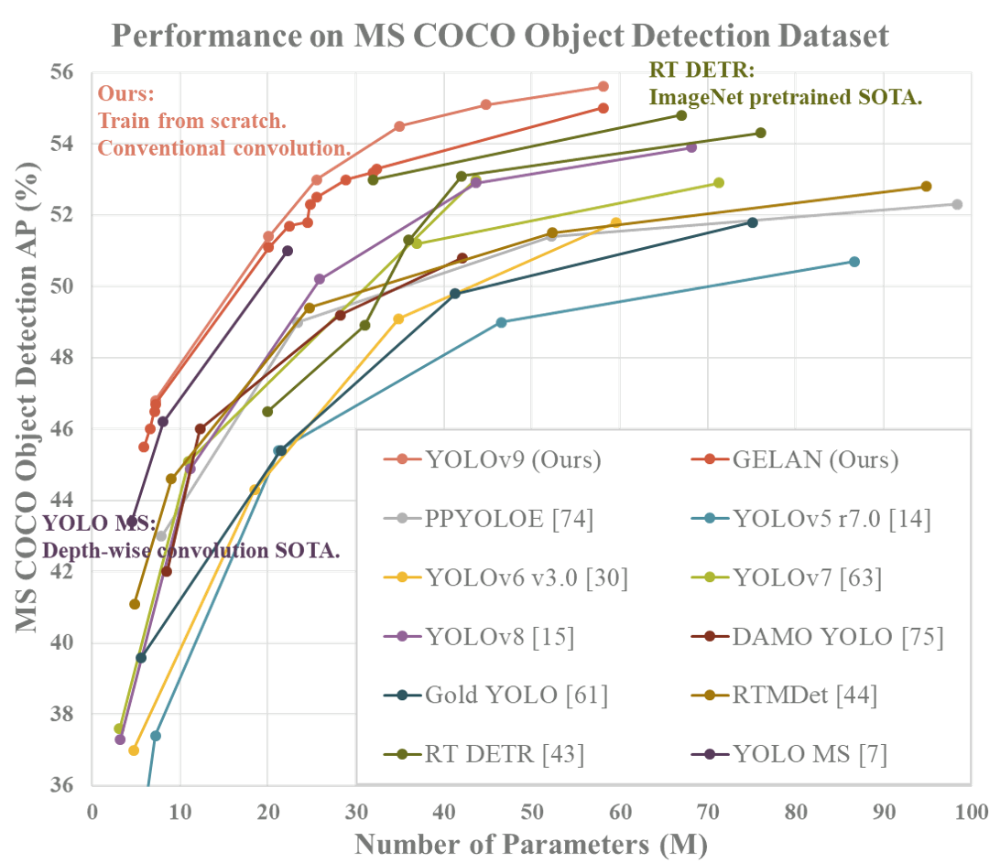

# OnePiece-Classifier
Project conducted using YOLOv9 to classify characters from the anime One Piece.
  
## Performance 

| Model | Precision | Recall | mAP<sub>50</sub> | mAP<sub>50-95</sub> | Param. |
| :-- | :-: | :-: | :-: | :-: | :-: |
| [**GELAN-C**](https://github.com/WongKinYiu/yolov9/releases/download/v0.1/gelan-c-seg.pt) | **96.2%** | **94%** | **96.5%** | **88.3%** | **~2.5M** |

## Usage
You can use this model to detect One Piece characters on videos or images.

``` shell
python detect.py \
--img 1280 --conf 0.1 --device 0 \
--weights ./runs/train/exp3/weights/best.pt \
--source ./One-Piece-Character-Classification-9/test/images
```
To know how to properly use this parameters, see [**YOLOv9**](https://github.com/WongKinYiu/yolov9/blob/main/detect.py)

<div align="center">
    <a href="./">
        
    </a>
</div>

